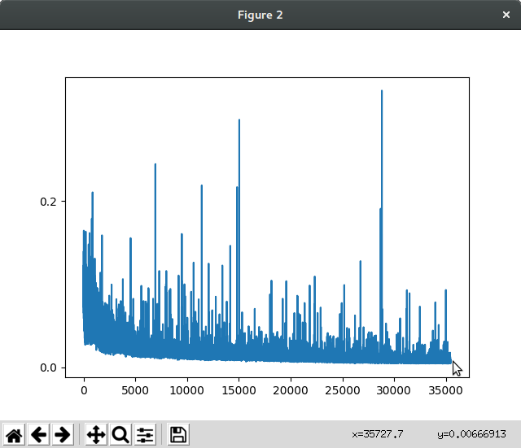
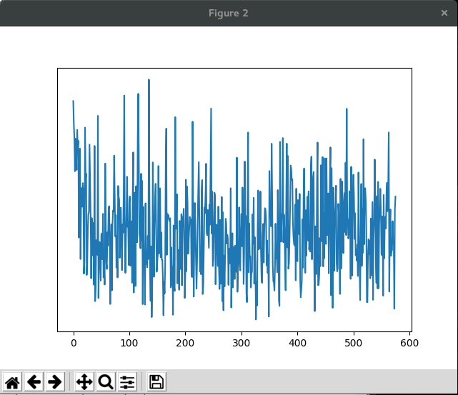
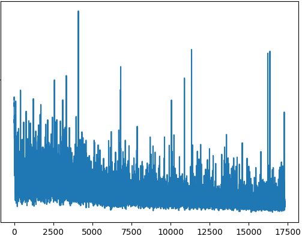

# Filtering Muscular Interference from EEG Brain Data on Consumer Grade Devices using Neural Networks

A Computer Honours Project under supervision of Dr. Neil Bruce for the University of Manitoba.

---

## Blog Updates

#### March 20th, 2018
In the last 2 weeks I created a simple auto-encoder to run on the BCI sleep data. The encoder was built by adapting the [language translating encoder that is shown in the pytorch tutorials](http://pytorch.org/tutorials/intermediate/seq2seq_translation_tutorial.html), and have it run on EEG data instead.

My first attempt at using the auto-encoder was to encode a single channel of data by first reading in 100 data points, compressing it down (linear) to a hidden vector of 5 in length, and input into the recurrent net. This hidden vector is then fed into the decoder, which runs the vector through a recurrent net, then expanding (linear) back up to 100 points. We compare this output to our original input, calculate the loss, and propagate it back through the encoder/decoder.

By repeating this process the auto-encoder gets more efficient at compressing decompressing the data. We start with ~17725400 data points (512 points per second real time) which we break into 100 point chunks, and randomly select chunks 177254 x 2 times to run through the auto encoder. This process takes approximately 10 minutes on my Intel i5-3570K CPU.

When running the train function a single time, the loss we see ranges from 50-70%, at that point it is essentially random data as it has not encoded any structure yet. After running the auto encoder for the full 354508 times, we see a very tiny loss of between 0.5-1.5%.

This graph plots the the average loss over time as the encoder is trained.

Next I used the Sequence to Sequence techniques to try to predict sections of data points given some sequence of data points. My first idea was to encode 1 second of data at a time over 30 seconds for a data sequence of 512 x 30 long, resulting in approximately 1154 inputs to train on, then train this data 5 times over. (reducing in size to 1/10th size)

This takes about 12 minutes to run.

Unfortunately this did not converge nicely as the previous one did

Then I tried to scale down my encoding down to 1/4 second increments for a 4 second sequence to try to have better convergence during the training. 128 x 4, for ~34620 inputs, again running 5x over.

In addition to this change in size, I added in teacher forcing at a rate of 50% to try to improve the convergence rate.

This takes almost 20 minutes to run.

At this point we are seeing about double the convergence that we saw in our second trial (50-70% loss to 25-40%), and based off our 50% teacher forcing ratio this shows that the encoder is not learning to predict well enough based off the training. This might be a good candidate for a longer training to see if it can encode better with more data inputs after more tweaks to the encoder.

Based off these results, it looks like a simple sequence to sequence model is not powerful enough to encode sequences of brain data. Using the simple recurrent model however did show promising results so we will be moving away from sequence to sequence and focusing on the simple model for the remainder of the project.

Note: I have omitted many of my failed attempts as they would have taken anywhere from days (or months) to run to completion. With better hardware and more time there might be some more interesting training options to try.

[Click here to view the code used to run these trials](https://github.com/JeffreyThiessen/eeg_timeseries_autoencoder)

---

#### March 3rd, 2018
After working on trying to use the EEG data I showed last week, I ran into a few issues. Mainly that the data itself did not have the events in their own channel in the data and instead were attached to a separate text file. I lost more time than I would have liked to this and other issues (such as my home machine only has 8GB of ram which caused loading problems that took some time to fix). Between that and Midterm exams, progress was slow but I feel that I have learned a lot in the last weeks.

After talking with Dr. Bruce we felt that going forward we will want to start with a simpler approach. Specifically I will be using/creating an autoencoder on the data to encode the REM/NREM states and examining what we can see in the data from there.

---

#### February 12, 2018
Just a small update this week. I have been taking a look at different public data sets that could possibly be used to try to isolate eye movement interference.

The data set that showed the most promise was [this EEG data on sleep activity.](https://physionet.org/pn6/capslpdb/) There are 16 sets of control data in this set that should provide a good base to try to analyse.

My plan going forward will be to run the data through a modified version of the Braindecode algorithms we saw last week and use the MNE tools to analyse the results.

I'll be using the epochs marked for REM and NREM sleep as the difference between eye movement and no eye movement. Them I'll see if we can see localization in the regions near the front of the head where eye movement would cause the most interference.

---

#### February 4, 2018
This last week I looked more closely at some of the available EEG related machine learning libraries and tools. One particular toolbox [Braindecode](https://robintibor.github.io/braindecode/) looked very promising so I decided to go through the tutorials and see what it all can do. 
 
Branedecode is a toolbox designed to decode raw time-domain EEG data. It works with PyTorch and [MNE](https://www.martinos.org/mne/stable/index.html) to create easy to use neural net tools. 
 
By shaping the data to the Braindecode format we can easily create a neural network to decode, crop-decode, and visualize data. One really nice tool I tried was their method for computing correlation. It can be used to plot the localized predictions the model is making on the data channels. 
 
Unfortunately my home computer is not powerful enough to handle the full trial data they recommend in their tutorial. I was only able to to use ~40% of the data while creating the model without running out of memory. Even so I was able to generate this figure showing the localized correlations between the data channels and right hand vs left hand movement. 
 
 
 
To see the data and code provided by Braindecode [click here for the full tutorial](https://robintibor.github.io/braindecode/notebooks/visualization/Perturbation.html)

---

#### January 28, 2018
In the last week I have been familiarizing myself with the pytorch machine learning environment as it looks to be a solid framework to use for this project. I have found a few different projects others have done on BCI and EEG data that might prove to be a great foundation for this project, but I'll need to look more closely at them before making any decisions. 

I have also been updating my knowledge on modern CNN and RNN algorithms, as the ammount of machine learning I knew before starting the project was not nearly enough to create and understand the workings of a recurrent neural network.

I found the following resources to be the most helpful in my learning so I figured I would link them here so you too can get a better understanding of neural networks.

[Mind: How to build a neural network](http://stevenmiller888.github.io/mind-how-to-build-a-neural-network/): A great introduction to neural networks.

[Video Lecture: Recurrent Neural Networks by Stanford University](https://www.youtube.com/watch?v=6niqTuYFZLQ): An indepth look at recurrent neural networks and how they can be used.

[PyTorch tutorials overview](http://pytorch.org/tutorials/index.html): The basics of using PyTorch.

[PyTorch tutorial on RNN classification](http://pytorch.org/tutorials/intermediate/char_rnn_classification_tutorial.html): A more advanced tutorial on RNN and how they can be built.
