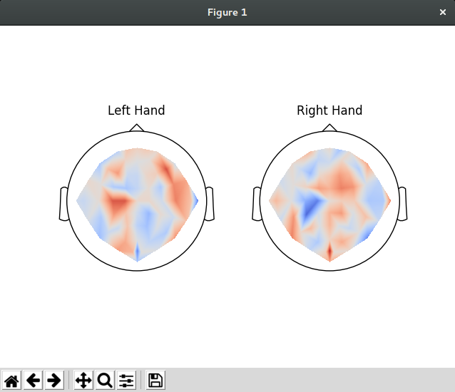

# Filtering Muscular Interference from EEG Brain Data on Consumer Grade Devices using Neural Networks

A Computer Honours Project under supervision of Dr. Neil Bruce for the University of Manitoba.

---

## Blog Updates

#### February 4, 2018
This last week I looked more closely at some of the available EEG related machine learning libraries and tools. One particular toolbox [Braindecode](https://robintibor.github.io/braindecode/) looked very promising so I decided to go through the tutorials and see what it all can do. 
 
Branedecode is a toolbox designed to decode raw time-domain EEG data. It works with PyTorch and [MNE](https://www.martinos.org/mne/stable/index.html) to create easy to use neural net tools. 
 
By shaping the data to the Braindecode format we can easily create a neural network to decode, crop-decode, and visualize data. One really nice tool I tried was their method for computing correlation. It can be used to plot the localized predictions the model is making on the data channels. 
 
Unfortunately my home computer is not powerful enough to handle the full trial data they recommend in their tutorial. I was only able to to use ~40% of the data while creating the model without running out of memory. Even so I was able to generate this figure showing the localized correlations between the data channels and right hand vs left hand movement. 
 
 
 
To see the data and code provided by Braindecode [click here for the full tutorial](https://robintibor.github.io/braindecode/notebooks/visualization/Perturbation.html)

---

#### January 28, 2018
In the last week I have been familiarizing myself with the pytorch machine learning environment as it looks to be a solid framework to use for this project. I have found a few different projects others have done on BCI and EEG data that might prove to be a great foundation for this project, but I'll need to look more closely at them before making any decisions. 

I have also been updating my knowledge on modern CNN and RNN algorithms, as the ammount of machine learning I knew before starting the project was not nearly enough to create and understand the workings of a recurrent neural network.

I found the following resources to be the most helpful in my learning so I figured I would link them here so you too can get a better understanding of neural networks.

[Mind: How to build a neural network](http://stevenmiller888.github.io/mind-how-to-build-a-neural-network/): A great introduction to neural networks.

[Video Lecture: Recurrent Neural Networks by Stanford University](https://www.youtube.com/watch?v=6niqTuYFZLQ): An indepth look at recurrent neural networks and how they can be used.

[PyTorch tutorials overview](http://pytorch.org/tutorials/index.html): The basics of using PyTorch.

[PyTorch tutorial on RNN classification](http://pytorch.org/tutorials/intermediate/char_rnn_classification_tutorial.html): A more advanced tutorial on RNN and how they can be built.
