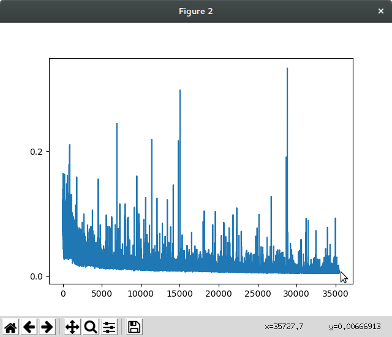
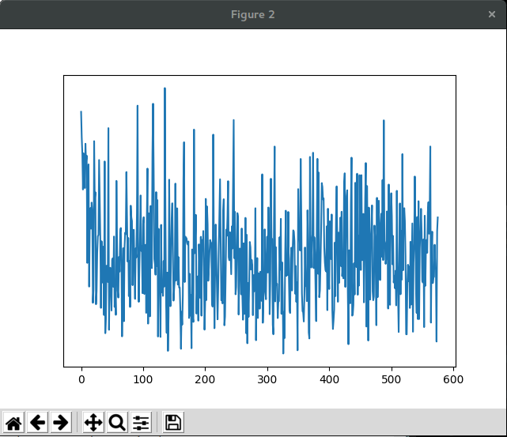

# Filtering Muscular Interference from EEG Brain Data on Consumer Grade Devices using Neural Networks

A Computer Honours Project under supervision of Dr. Neil Bruce for the University of Manitoba.

---

### About This Project
The goal of this project is to determine the extent to which a computer or devices can be controlled via neural activation and EEG while controlling for activation associated with muscle control.

[Read more about the project here](/projects/bci/overview)

---

### Latest Project Blog Update

#### March 20th, 2018
In the last 2 weeks I created a simple auto-encoder to run on the BCI sleep data. The encoder was built by adapting the [language translating encoder that is shown in the pytorch tutorials](http://pytorch.org/tutorials/intermediate/seq2seq_translation_tutorial.html), and have it run on EEG data instead.

My first attempt at using the auto-encoder was to encode a single channel of data by first reading in 100 data points, compressing it down (linear) to a hidden vector of 5 in length, and input into the recurrent net. This hidden vector is then fed into the decoder, which runs the vector through a recurrent net, then expanding (linear) back up to 100 points. We compare this output to our original input, calculate the loss, and propagate it back through the encoder/decoder.

By repeating this process the auto-encoder gets more efficient at compressing decompressing the data. We start with ~17725400 data points (512 points per second real time) which we break into 100 point chunks, and randomly select chunks 177254 x 2 times to run through the auto encoder. This process takes approximately 10 minutes on my Intel i5-3570K CPU.

When running the train function a single time, the loss we see ranges from 50-70%, at that point it is essentially random data as it has not encoded any structure yet. After running the auto encoder for the full 354508 times, we see a very tiny loss of between 0.5-1.5%.

This graph plots the the average loss over time as the encoder is trained.

Next I used the Sequence to Sequence techniques to try to predict sections of data points given some sequence of data points. My first idea was to encode 1 second of data at a time over 30 seconds for a data sequence of 512 x 30 long, resulting in approximately 1154 inputs to train on, then train this data 5 times over. (reducing in size to 1/10th size)

This takes about 12 minutes to run.

Unfortunately this did not converge nicely as the previous one did

Then I tried to scale down my encoding down to 1/4 second increments for a 4 second sequence to try to have better convergence during the training. 128 x 4, for ~34620 inputs, again running 5x over.

In addition to this change in size, I added in teacher forcing at a rate of 50% to try to improve the convergence rate.

This takes almost 20 minutes to run.

At this point we are seeing about double the convergence that we saw in our second trial (50-70% loss to 25-40%), and based off our 50% teacher forcing ratio this shows that the encoder is not learning to predict well enough based off the training. This might be a good candidate for a longer training to see if it can encode better with more data inputs after more tweaks to the encoder.

Based off these results, it looks like a simple sequence to sequence model is not powerful enough to encode sequences of brain data. Using the simple recurrent model however did show promising results so we will be moving away from sequence to sequence and focusing on the simple model for the remainder of the project.

Note: I have omitted many of my failed attempts as they would have taken anywhere from days (or months) to run to completion. With better hardware and more time there might be some more interesting training options to try.

[Click here to view the code used to run these trials](https://github.com/JeffreyThiessen/eeg_timeseries_autoencoder)

---

[Read the full blog here](/projects/bci/blog)
