# Filtering Muscular Interference from EEG Brain Data on Consumer Grade Devices using Neural Networks

A Computer Honours Project under supervision of Dr. Neil Bruce for the University of Manitoba.

---

### About This Project
The goal of this project is to determine the extent to which a computer or devices can be controlled via neural activation and EEG while controlling for activation associated with muscle control.

[Read more about the project here](/projects/bci/overview)

---

### Latest Project Blog Update

#### April 7th, 2018

##### Analysis Part 1

The first part of our analysis of will be to look at encoded data as a whole, and compare it to other sampled encoded data. After training the encoders as we saw last week, we ran t-SNE on the data.

In these t-SNE data plots, a single point on the graph is reduced from 45 or 18 dimensions (Encoder A or B) down to 2 dimensions. We ran t-SNE at multiple perplexities to try to get a better sense of the data.

See last weeks blog entry for more information on the encoders.

The following all have 1000 randomly chosen samples, each represented by a single data point.

Perplexity|Encoder A|Encoder B
---|---|---
5|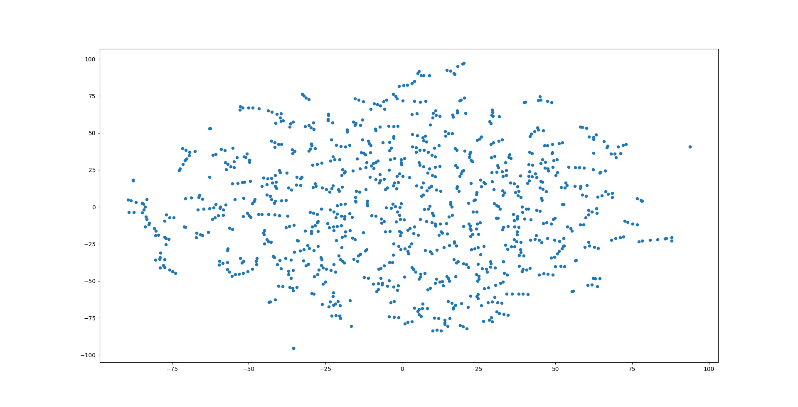|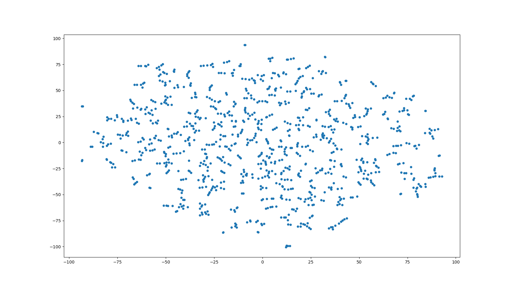
10||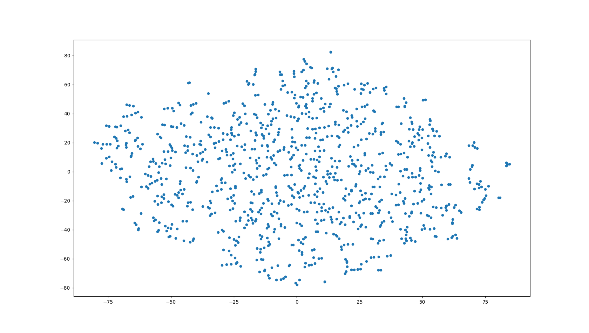
20||

If the encoders was able differentiate large differences in the different sleeps states, we would expect to see a few larger groups of data points in these images. We instead see small groupings, with most of the distribution of points and groups being similar to what we would expect of random data. Since our model reduced our data with very little loss, we know that it must be encoding it in some way, but sleep state may not have as big of an impact on the data as we thought.

I also ran t-SNE on a larger sample size (5000) reducing from 18 dimensions to 3, at a perplexity of 5. The following images are all of the same t-SNE plotting at slightly different angles so you can better see the data groupings in 3 dimensions.

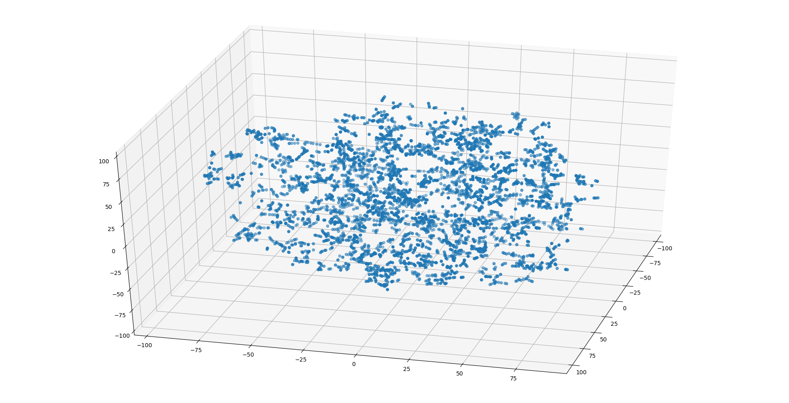
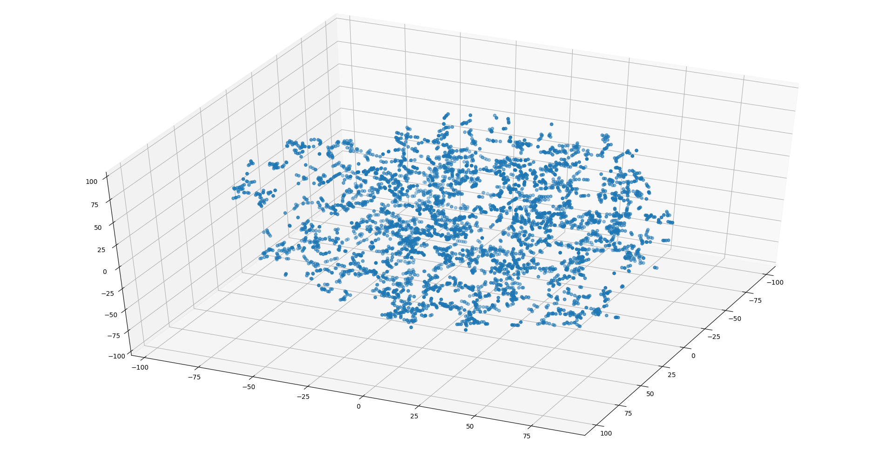

##### Analysis Part 2
In the second part of our analysis we will be looking at how the encoded data in 45 and 18 dimensions relate to each other.

This is done by either randomly sampling data to encode, or taking data sequentially from a given starting point and encoding it. Once again, it will be encoded down to 45 or 18 dimensions for any given data. From encoded data, we would like to create a point for each of the 45 or 18 encoded points and plot it, doing the same for many sets of encoded data. Unfortunately when doing this it becomes computationally expensive very quickly, and there is no guarantee that that single encoded data points will be good representations of the data as a whole.

For example, Here we are using 100 random data points for each of the 45 dimensions, resulting in independent lines of points for each, not giving us any valuable grouping information.|| 

So instead of taking single data points, we line up our encoded data such that each of the 18 or 45 points has 50 or 500 values. This means that each of the 18 or 45 points has either 50 or 500 values (depending on which trial) to represent it. We repeat this process 10 times so that we have 10 points to plot for each of our 18 or 45 points. This way we can see if the 18 or 45 point have similarities in data (are encoding similar things from the data).

We run the t-SNE at multiple reduction values to get a better understanding of the shape of the data, always reducing it down to 2 dimensions. A perplexity of 20 was used in all cases.

Each colour in the plot represent a different point from the 18 or 45 points that get plotted. It may also be good to note that similar colours does not always mean relation, only that the points are next to each other in the original encoding. 2 points may be next to each other but encoding completely unrelated things while points that are related an be spread far apart in the encoding.

Info|Encoder A|Encoder B
---|---|---
Data points length|50|50
Data selection|Random|Random
Starting Dims = 45||
Starting Dims = 9||
Starting Dims = 1|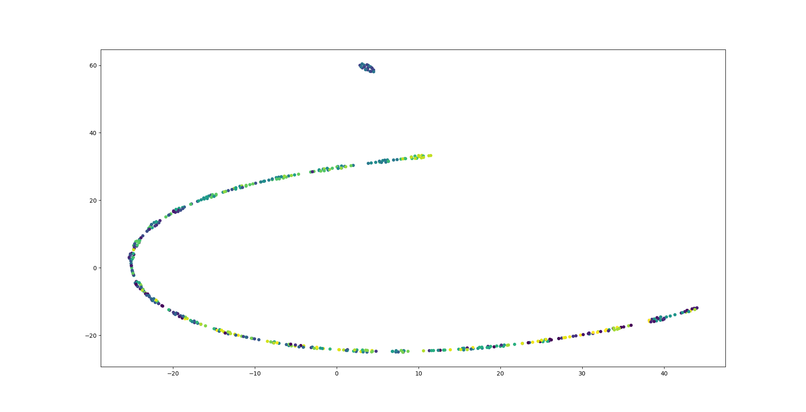|
—|—|—
Data points length|500|500
Data selection|Random|Random
Starting Dims = 45||
Starting Dims = 9||
Starting Dims = 1|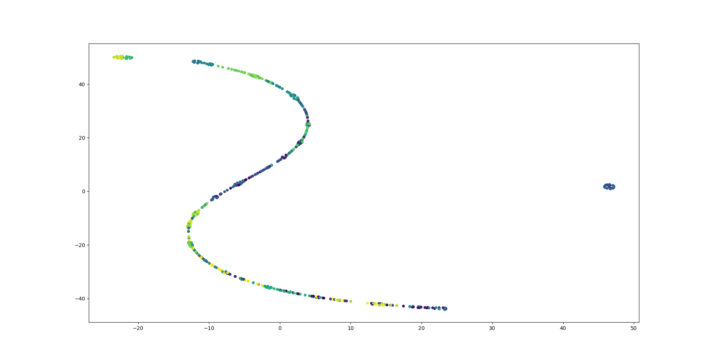|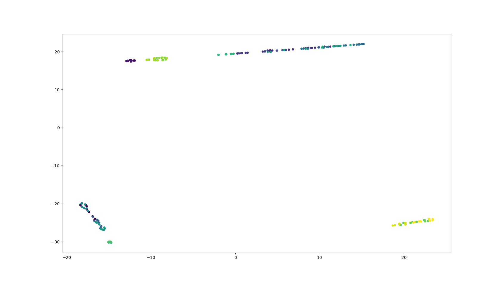
---|---|---

From these plots we can see that there are some obvious groupings and banding of the same colours through some of graphs, while others have a semi structured random distribution of points.

When starting dims is set to 1, we do not get very much meaningful information. The groupings that do show are the same as we see in higher dimensions which also give more clarity.

When using sequential data and specifying the starting point to be the start of the data we got some results with nice banding||

But most results looked closer to random noise. It is possible that the starting area of data was not as clean as we would like and should have been removed before we trained our encoder.||

We moved the starting point in for the following sequential data point plots

Info|Encoder A|Encoder B
---|---|---
Data points length|50|50
Data selection|Sequential|Sequential
Starting Dims = 45||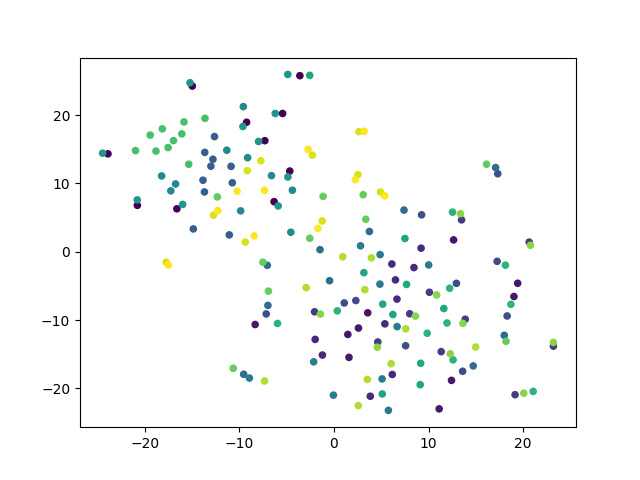
Starting Dims = 9|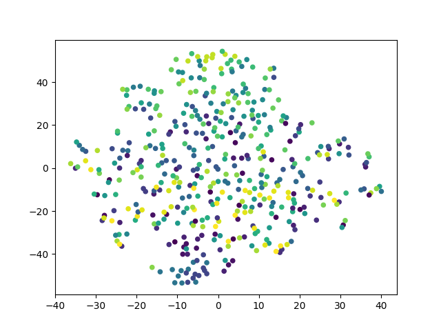|
—|—|—
Data points length|500|500
Data selection|Sequential|Sequential
Starting Dims = 45|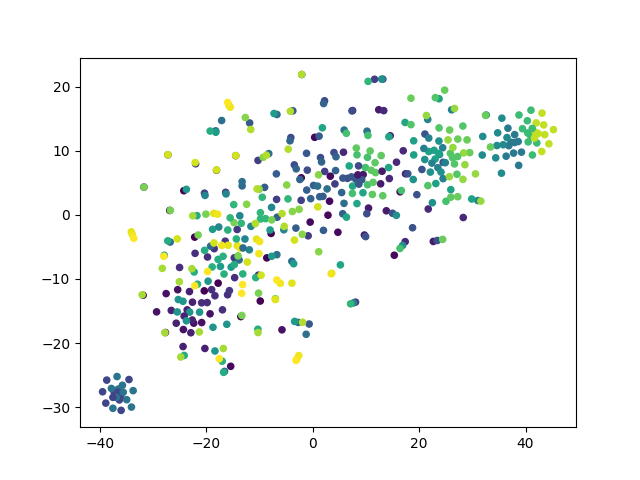|
Starting Dims = 9||
---|---|---

As we might expect, data that is sequential, and thus in the same sleep state, has more similarity between the values in the hidden vectors. We can see much clearer banding and groupings in this data set than we did in the randomly selected ones.

The banding of points could likely be that the different values in the hidden vector are each doing different jobs within the encoding itself. Another interesting observation is that when we look at the plots we can often see pairs of different colours overlapping in multiple places on the plot. This suggests that these points are pairwise encoding together and may be working in tandem to encode some information in a "one on, one off" manner.

The t-SNE analysis gave us a lot of good information about how our neural net is encoding the EEG data, and would be very useful going forward if we had the time to follow up with data that we generate ourselves.

##### Final Thoughts

I feel as though we have begun to understand more about EEG data and now have a better understanding on how we can approach machine learning solutions to EEG problems. Unfortunately we did not get to do all the things we originally set out to do at the beginning of this project but looking back we see that we were extremely optimistic about what we could accomplish. Adding hardware and live data reading to the mix would have been fun to do but in the short amount of time we had, it would not have been possible. Learning and implementing the tools and networks on sample EEG data took quite a bit of time so once we begun analysis on the models we made, the semester was in it's final month. We can see that these techniques are successful and would likely warrant another honours project as a follow up, or even a masters thesis to take it further. 

---

[Read the full blog here](/projects/bci/blog)
