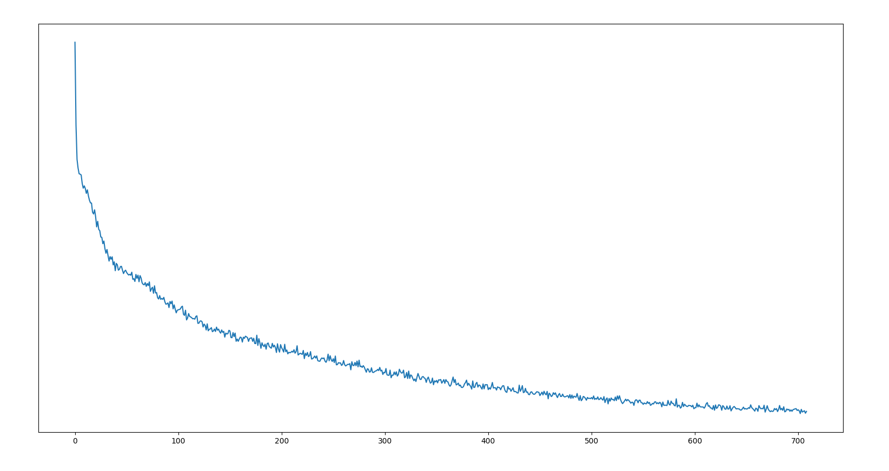
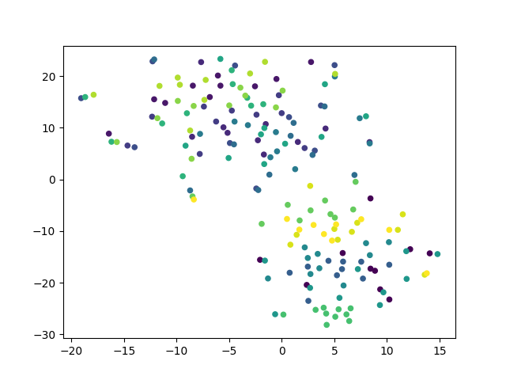
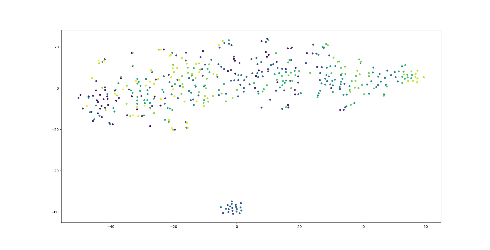
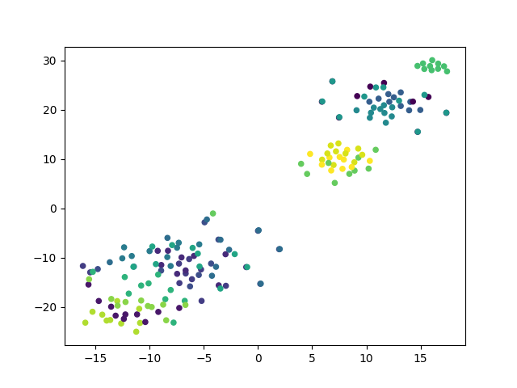
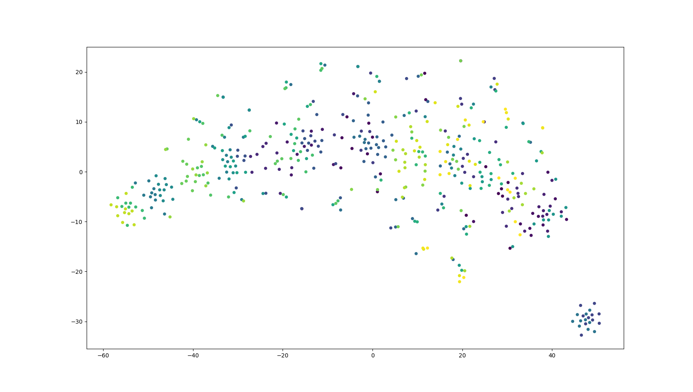

# Filtering Muscular Interference from EEG Brain Data on Consumer Grade Devices using Neural Networks

A Computer Honours Project under supervision of Dr. Neil Bruce for the University of Manitoba.

---

### About This Project
The goal of this project is to determine the extent to which a computer or devices can be controlled via neural activation and EEG while controlling for activation associated with muscle control.

[Read more about the project here](/projects/bci/overview)

---

### Latest Project Blog Update

#### April 1st, 2018
Jumping off of my last blog post, this week I focused on cleaning up the basic auto-encoder, training it on our EEG data, and running analysis tools on it.

I started by training the encoder in two slightly different ways, with the key difference being the size of the hidden vector.

Both were trained on the same dataset, selecting chunks of data at random. For each dataset we iterated randomly over the dataset 20 times.

desc|Method A|Method B
---|---|---
Length Per Channel|100|100
Hidden Nodes Per Channel|5|2
Channels|9|9
Input Size|900|900
Hidden Size|45|18
Output Size|900|900
Dataset ittr|20|20
Total train ittr|3545080|3545080
Time To Train|102m 20s|92m 17s
Loss over time||
Final Average Loss|0.0151|0.0256

A point of interest here is that that with less than half the hidden channel nodes, we less than twice the loss. This might be able to be mitigated with a longer training time.

To analyze these encoders we will be examining what the hidden states look like when a single data entry is given to the encoder. During the training process we do the following:

`input (900)` --> `encode` --> `hidden (45 || 18)` --> `decode` --> `output (900)`

But we will be stopping after the encode step and keeping the hidden vector. We do this repeatedly to get a collection of encoded data that we can use to see if we can find patterns of how it is encoded. To do this we use t-SNE to change the data into a plot graph while retaining the relative positions of the data. This should give us an idea of how the different data points relate to each other.

[Click here for a great resource on t-SNE](https://lvdmaaten.github.io/tsne/)

For now here are a few example pictures of what the t-SNE plots I generated look like. Next week I will have more details on the parameters used, and an in-depth analysis on our results.

Method A|Method B
---|---
|
|
|

The above were generated with the same parameters for the Method A/B counterparts (although some are zoomed in so the dots are larger/smaller).

[Click here to view the encoders code and examples of code used to generate t-SNE graphs](https://github.com/JeffreyThiessen/eeg_basic_autoencoder)

---

[Read the full blog here](/projects/bci/blog)
